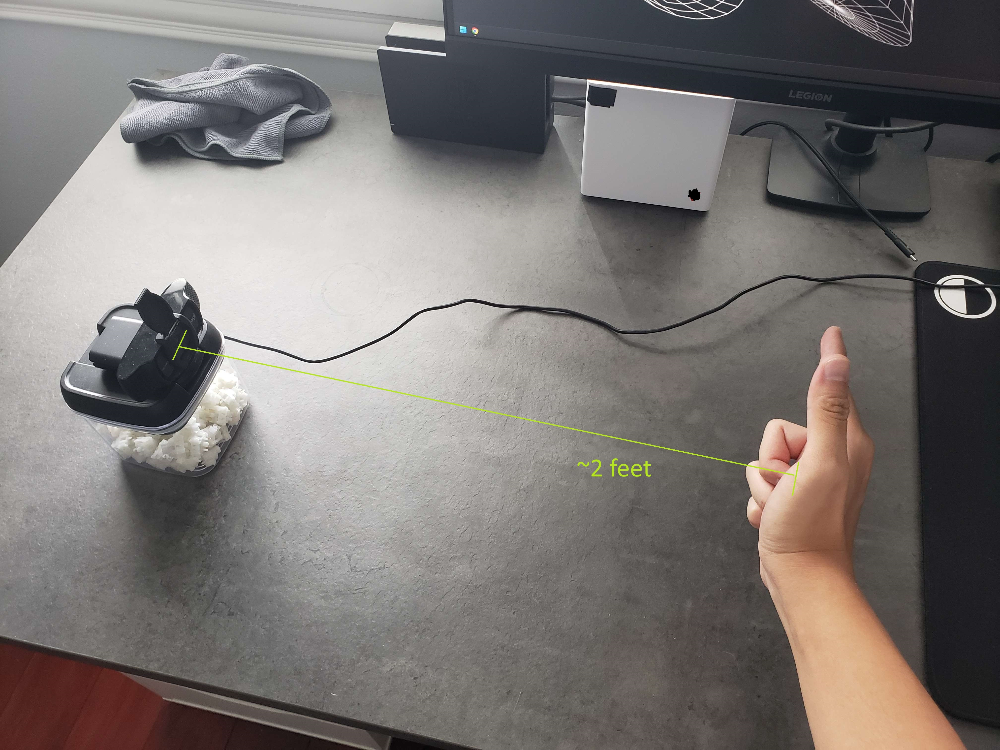

# fingergun
A lightweight virtual air gun implemented with perspective-n-point using Google Mediapipe, OpenCV, and PyDirectInput libraries.
## Demo

## Features
- 3D hand tracking mapped to relative mouse movements for use in first-person games
- Gesture recognition for shooting, reloading, and hovering (demonstration below)
## Setup
**Note**: This script will only work properly on Windows as mouse inputs are sent under-the-hood using the Windows API.

The necessary dependencies are listed in `requirements.txt` and can be installed through `pip`: \
`pip3 install -r requirements.txt`

Simply run `main.py` to activate the script: \
`python3 ./fingergun/main.py`

## Usage
Position the webcam on a flat raised surface, level to the expected neutral hand position, ~2 feet left of and facing the operating area (further distances may allow for a greater range of movement, but with decreased tracking accuracy)

### Aiming
Mouse movement maps to the real-world position of the index finger projected onto a vertical plane facing the user (perpendicular to the camera)

### Shooting
Lower the thumb onto the index finger to send trigger a mouse click down, which will be held until this pose is no longer detected

### Reloading
Tilt the hand counterclockwise reducing the angle the palm makes with the ground, which by default will send a 'r' keystroke (rotating the hand too much will cause the model to lose track of the hand)

### Hovering
Retract the index finger, halting all mouse movement to allow for readjustment of the hand (to prevent the hand from moving out of the image)

